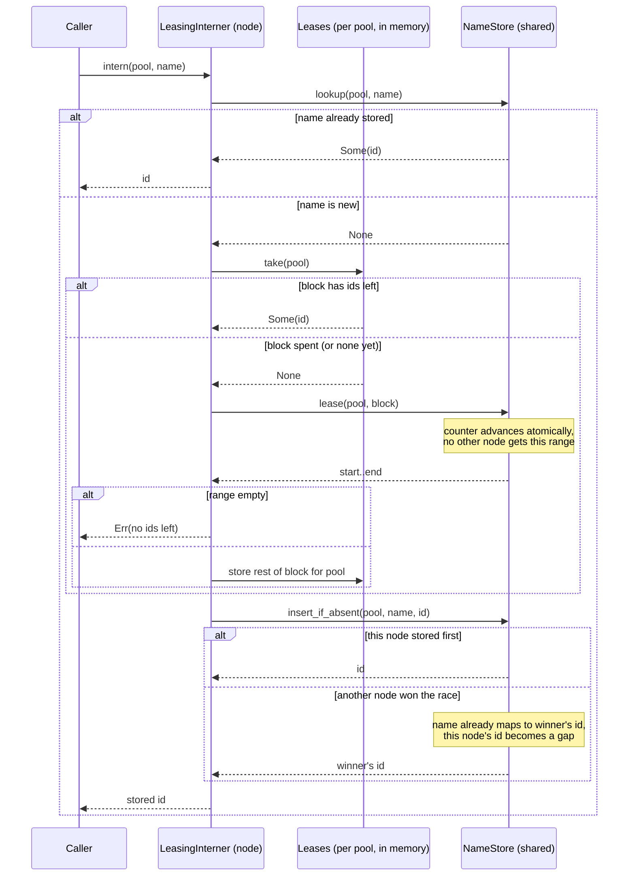

# Interner

How `LeasingInterner` mints an id for a name. Each node runs its own interner over the shared `NameStore`.

## Which names are interned

Theory and relation names only, in `Pool::Theories` and `Pool::Relations`. Resource ids and identities stay strings in facts.

- Theory and relation names are few and bounded, and change only with a theory version, so every node can cache the whole dictionary.
- Resource ids and identities are unbounded and grow with the fact store. Interning them would make the dictionary a second large store: replicated to every node, read on every check, written in revision order with the facts so a name resolves at least as fresh as the zookie, and garbage-collected as facts go. A `u32` id would also cap them at about four billion.

## Minting an id

The store is touched in three places, each a single atomic operation:

1. `lookup` is the fast path; every name after its first use ends here.
2. `lease` reaches the shared counter once per block, not once per name.
3. `insert_if_absent` is the conditional insert that settles a race to whichever id was stored first.
